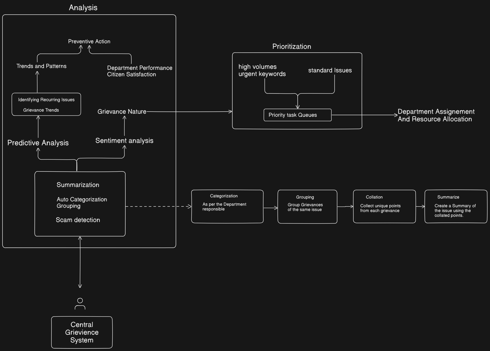
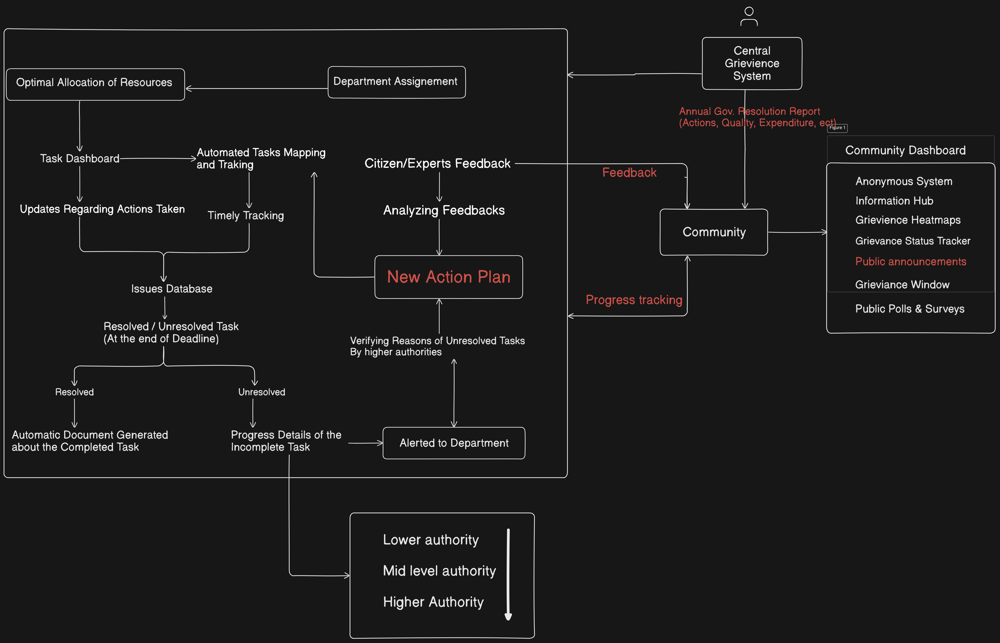
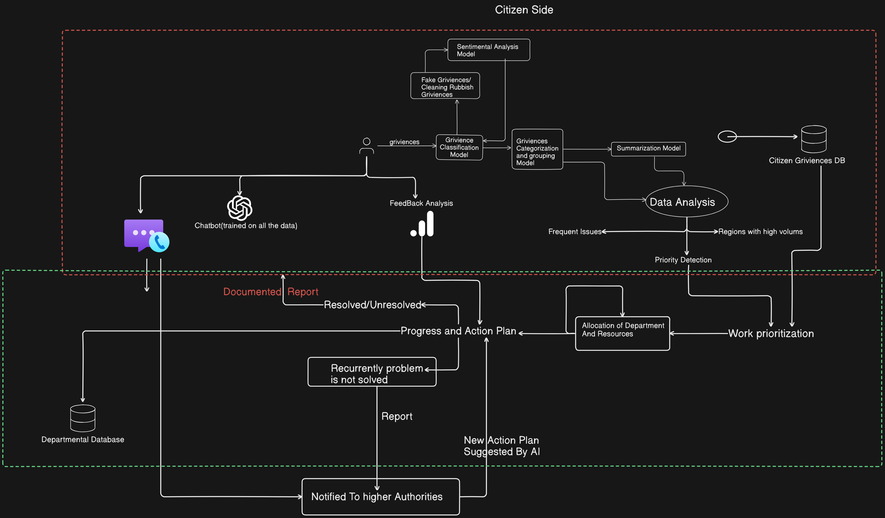

# UP-IGRS: Integrated Grievance Redressal System

## 🎯 Project Overview

UP-IGRS is a comprehensive, AI-powered grievance management system designed for Uttar Pradesh. It combines advanced machine learning capabilities with a user-friendly interface to streamline the process of submitting, tracking, and resolving citizen grievances.

## 🏗️ System Architecture




The project is divided into three main components:

```plaintext
/
├── frontend/           # User interfaces
│   ├── grievancesystem/   # Citizen portal
│   └── officials-portal/  # Officials dashboard
├── backend/           # Server and database
└── ML/               # AI/ML components
```

## 🚀 Key Features

### 1. Citizen Portal
- Intuitive grievance submission interface
- Multi-language support
- Real-time tracking
- Feedback system
- Mobile-responsive design

### 2. Officials Portal
- Comprehensive dashboard
- Department-wise management
- Resource allocation
- Analytics and reporting
- Performance monitoring

### 3. AI/ML Capabilities
- Sentiment analysis
- Fake grievance detection
- Image-based verification
- Trend analysis
- Impact assessment
- Automated routing

### 4. Backend System
- Robust PostgreSQL database
- Hierarchical authority management
- Secure data handling
- Scalable architecture
- Efficient workflows

## 💻 Technology Stack

### Frontend
- React 18
- TypeScript
- TailwindCSS
- Redux Toolkit
- Shadcn/ui

### Backend
- Node.js
- PostgreSQL
- Prisma ORM
- Express.js
- JWT Authentication

### ML/AI
- PyTorch
- XLM-RoBERTa
- BERT Models
- Computer Vision
- NLP Processing

## 📚 Detailed Documentation

Each component has its own detailed documentation:

1. [Frontend Documentation](./frontend/README.md)


2. [ML System Documentation](./ML/README.md)
   - AI Components
   - Model Architecture
   - Processing Pipeline

3. [Backend Documentation](./backend/README.md)
   - Database Schema
   - API Documentation
   - Authentication System


### Prerequisites
- Node.js 16+
- Python 3.8+
- PostgreSQL 13+
- GPU for ML components (recommended)

